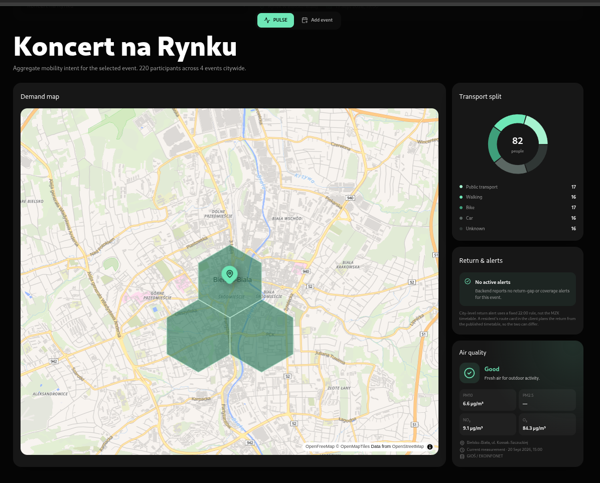
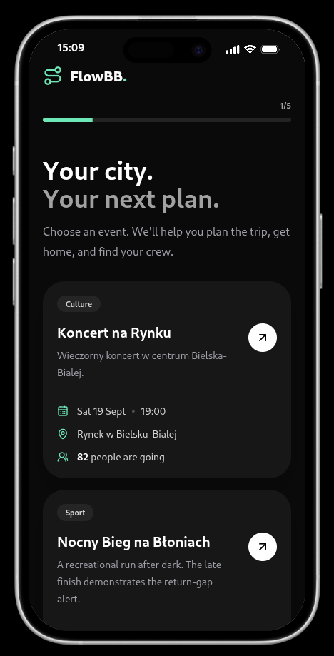
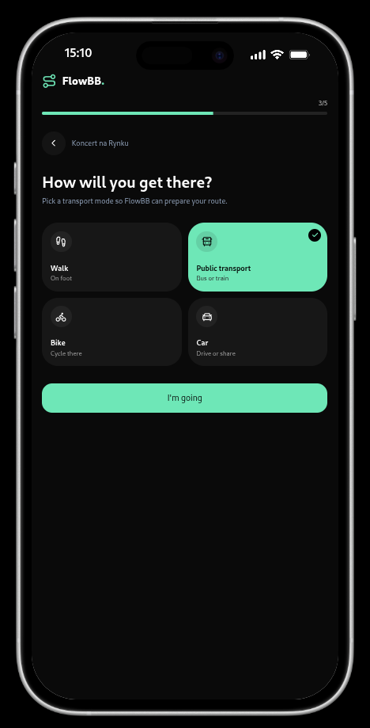
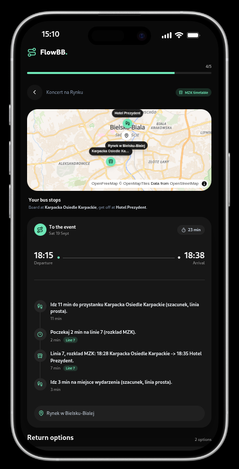
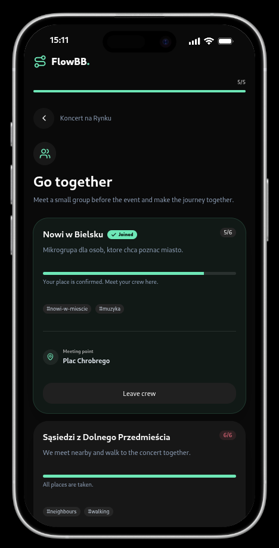
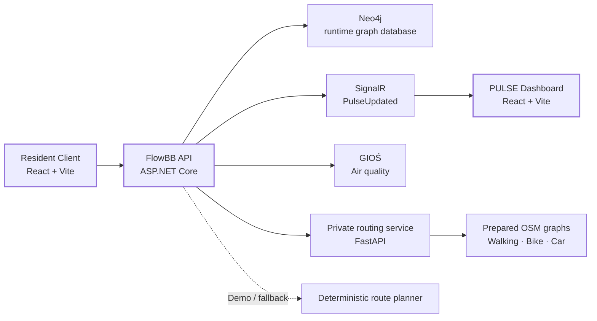

<div align="center">

# FlowBB

FlowBB connects event discovery, trip planning, small social crews and privacy-preserving mobility demand in one flow.

**HackBB 2026 · Bielsko-Biała**


</div>

<p align="center">
  
</p>

## What is FlowBB?

FlowBB is a prototype built around one simple idea: **an event should not end at the event card**.

A resident can discover an event, choose how they want to get there, declare attendance, receive a route and optionally join a small crew. At the same time, the city gets **aggregated, anonymous mobility demand** instead of individual tracking data.

| Module    | Purpose                                                                                        |
| --------- | ---------------------------------------------------------------------------------------------- |
| **FLOW**  | Discover events, choose transport and plan the journey there and back.                         |
| **CREW**  | Join small groups travelling to the same event and meet at a shared point.                     |
| **PULSE** | Show the city aggregated transport demand, modal split and spatial demand on a live dashboard. |

## Resident flow

<p align="center">
  
  
  
  
</p>

```text
Events
  → Event details
  → Choose transport
  → “I’m going”
  → Route
  → Crew
```

The event view also surfaces contextual information such as **air quality**, while the route view combines outbound and return journey options.

## Why it is useful

FlowBB connects two perspectives that are normally separated:

- **Residents** get a lightweight event-to-journey experience instead of manually combining event pages, maps and transport information.
- **City operators** see where demand is forming and which transport modes people intend to use.
- **Privacy is built into PULSE**: low-count spatial cells are not exposed, and public aggregate responses do not contain user IDs or exact individual starting points.
- **Realtime updates** let the dashboard react when attendance changes without requiring a refresh.

## Architecture



The public client talks only to the ASP.NET FlowBB API. The Python routing service is private and optional; the normal demo stack can run with deterministic routing.

## Main features

- Event discovery and event details
- Attendance declaration with transport preference
- Walking, bike, car and public-transport journey modes
- Outbound and return journey presentation
- CREW microgroups with join / leave flow
- PULSE dashboard with participant KPIs and transport split
- Aggregate demand map with GeoJSON / hexagon visualization
- Live dashboard reconciliation through SignalR
- Air-quality integration with GIOŚ and graceful fallback
- Organizer event creation
- OpenAPI-first frontend/backend contract
- Docker Compose development stack
- Optional OSM-based private road-routing service

## Tech stack

| Area               | Technologies                                                                          |
| ------------------ | ------------------------------------------------------------------------------------- |
| **Client**         | React 19, TypeScript, Vite, Tailwind CSS, TanStack Query, Zod, MapLibre, Motion       |
| **Dashboard**      | React 19, TypeScript, Vite, Tailwind CSS, TanStack Query, Recharts, MapLibre, deck.gl |
| **API**            | ASP.NET Core / .NET 10, C#, SignalR, OpenAPI                                          |
| **Database**       | Neo4j 5                                                                               |
| **Routing**        | Python, FastAPI, OSMnx, NetworkX, prepared OpenStreetMap graphs                       |
| **Observability**  | Serilog, Seq                                                                          |
| **Infrastructure** | Docker, Docker Compose, Nginx                                                         |

## Run locally

The default development stack includes the resident client, PULSE dashboard, ASP.NET API, Neo4j and Seq.

```bash
git clone https://github.com/JDKWss/FlowBB.git
cd FlowBB/infra

docker compose up --build -d
docker compose ps
```

Open:

| Service         | URL                     |
| --------------- | ----------------------- |
| Resident client | `http://localhost:5173` |
| PULSE dashboard | `http://localhost:5174` |
| API             | `http://localhost:8080` |
| Neo4j Browser   | `http://localhost:7474` |
| Seq             | `http://localhost:5341` |

Health checks:

```bash
curl http://localhost:8080/health
curl http://localhost:8080/health/ready
```

Reset the local stack and its data:

```bash
docker compose down -v
```

## Optional real road routing

The default stack uses the deterministic demo route planner. Real Walking / Bike / Car routing is available through a private FastAPI service backed by prepared OSM graphs.

Prepare the graphs once:

```bash
cd infra
docker compose --profile routing-tools run --rm routing-prepare
```

Start the real-routing profile:

```bash
ROUTING_MODE=RoadRouting \
docker compose --profile real-routing up --build -d
```

Public transport remains a deterministic demo flow in the current MVP.

## Repository structure

```text
FlowBB/
├── client/             # resident-facing mobile-first React app
├── dashboard/          # city / organizer PULSE dashboard
├── backend/            # ASP.NET Core API and application logic
├── routing-service/    # private FastAPI road-routing service
├── database/           # Neo4j model, seed and related data
├── contracts/          # OpenAPI contract and fixtures
├── data/               # supporting datasets / PoCs
├── docs/               # architecture, runbooks and ADRs
└── infra/              # Docker Compose and local infrastructure
```

## Contracts and project docs

The API contract is the source of truth for paths, DTOs, enums and response shapes:

- [`contracts/openapi.yaml`](contracts/openapi.yaml)
- [`AGENTS.md`](AGENTS.md)
- [`START_HERE.md`](START_HERE.md)
- [`docs/MVP_WORK_PLAN.md`](docs/MVP_WORK_PLAN.md)
- [`docs/DEMO_RUNBOOK.md`](docs/DEMO_RUNBOOK.md)
- [`docs/frontend.md`](docs/frontend.md)
- [`docs/ROUTING_SERVICE.md`](docs/ROUTING_SERVICE.md)
- [`docs/AIR_QUALITY.md`](docs/AIR_QUALITY.md)

## Demo notes

FlowBB was developed as a **HackBB 2026 prototype**. Demo / synthetic data is explicitly marked in the UI.

The critical end-to-end path is:

```text
Client
  → ASP.NET API
  → Neo4j
  → aggregate recalculation
  → SignalR
  → PULSE Dashboard
```

That means a resident action can become a city-level mobility signal in realtime, while the public dashboard stays aggregate rather than user-level.

---
